# 🛡️ ExpenseGuard

**Yapay Zeka Destekli Kurumsal Gider Yönetimi ve Fraud Tespit Platformu**

ExpenseGuard, orta ve büyük ölçekli B2B şirketler için tasarlanmış, çalışan masraflarını otomatikleştiren ve yapay zeka kullanarak finansal suistimalleri (fraud) tespit eden kurumsal düzeyde (enterprise-grade) bir SaaS platformudur.

Bulut tabanlı (cloud-native) mimarisi sayesinde platform; çok kiracılı (multi-tenant) veri izolasyonu, OCR ile asenkron fiş işleme, otomatik fraud tespiti ve rol bazlı finansal iş akışları sunar. Yüksek hacimli kurumsal verileri güvenlik ve uyumluluk standartlarından ödün vermeden işlemek üzere inşa edilmiştir.

---

## 🌟 Temel Özellikler

- **🤖 AI Destekli OCR & Fraud Tespiti:** Fiş veya fatura görüntülerinden Satıcı, Tarih, Tutar ve KDV bilgilerini otomatik çeker. Hafta sonu harcamaları, mükerrer girişler veya sektörel ortalama dışı şüpheli durumlar gibi anomalileri iş kurallarına göre analiz ederek olası fraud vakalarını işaretler.
- **🏢 Multi-Tenant (Çok Kiracılı) Mimari:** EF Core Global Query Filters kullanılarak veri izolasyonu sağlanır. Tek bir sunucu kurulumu, birbirinden tamamen bağımsız birden fazla şirkete güvenle hizmet verebilir.
- **🔐 Rol Bazlı Erişim Kontrolü (RBAC):** Sistem Yöneticileri, Departman Müdürleri, Çalışanlar ve Finansal Denetmenler için detaylı ve güvenli yetkilendirme altyapısı sunar.
- **📊 Gerçek Zamanlı Bütçe Takibi:** Departman bütçeleri Redis üzerinde anlık olarak takip edilir. Aylık ayrılan bütçeyi aşan harcamalarda sistem otomatik uyarı verir veya harcamayı engeller.
- **🛡️ İleri Düzey Güvenlik & Uyum:** KVKK/GDPR uyumluluğu (çerez yönetimi dahil), Rate Limiting, IDOR koruması ve SSRF/RCE saldırılarını önlemek için katı mimari kontroller.
- **🔄 Hibrit Çalışma Modu (Demo/API):** Frontend, backend API'sine erişilemediğinde otomatik olarak "Demo Mod"a geçerek, uygulamanın yeteneklerini (AI analiz simulasyonu, rol değişimleri) sergilemeye devam eder.
- **📑 Muhasebe Entegrasyonu:** Onaylanmış fiş ve harcamalar, ERP sistemlerine aktarılmak üzere doğrudan CSV formatında dışa aktarılabilir.
- **📈 Kurumsal SEO ve Analitik:** GA4 entegrasyonu ve JSON-LD yapılandırılmış veri standartları ile tam kurumsal görünürlük.

---

## 📸 Ekran Görüntüleri

<details>
<summary><b>Ekran Görüntülerini Görmek İçin Tıklayın</b></summary>

| | |
|:---:|:---:|
| 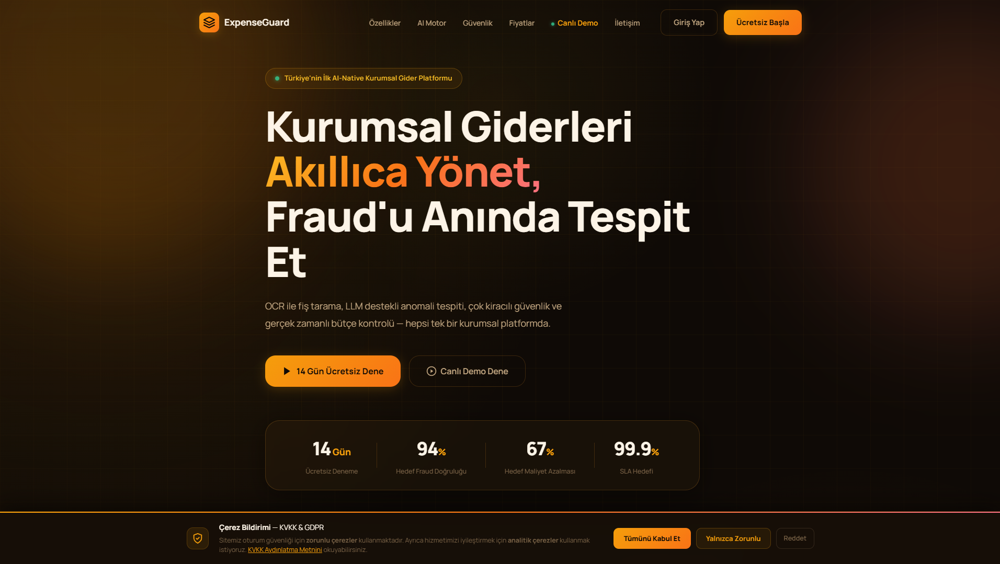 | 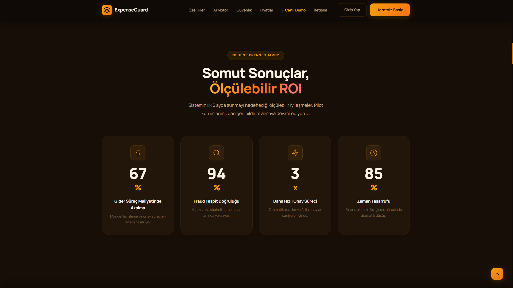 |
| 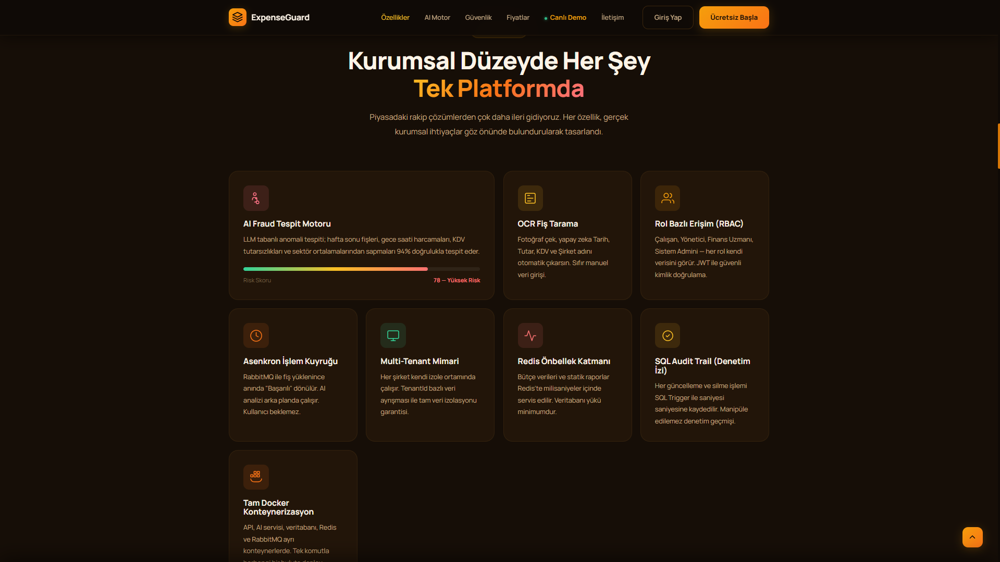 | 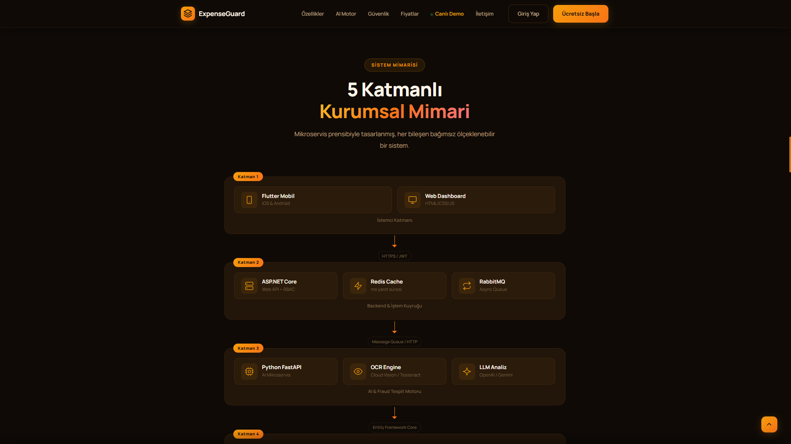 |
| 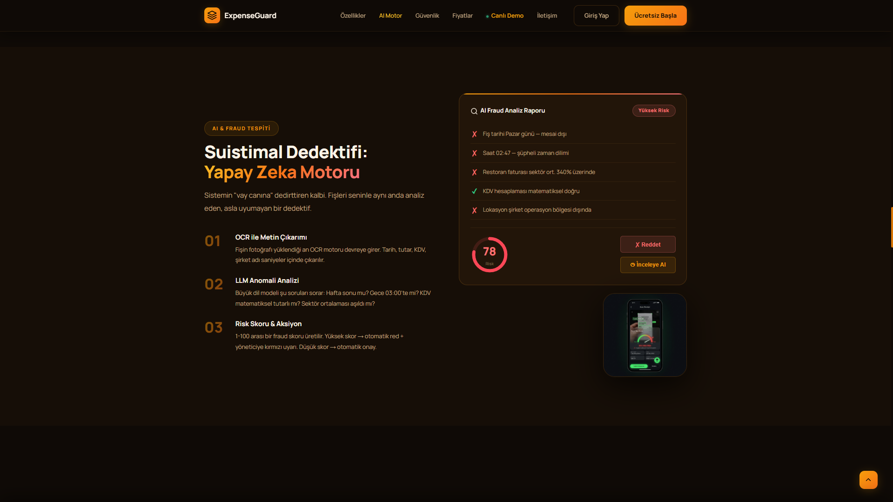 | 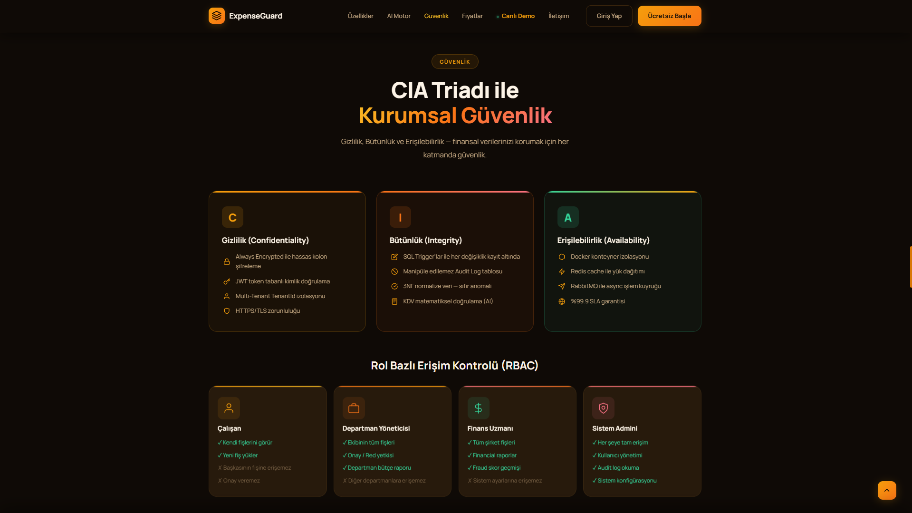 |
| 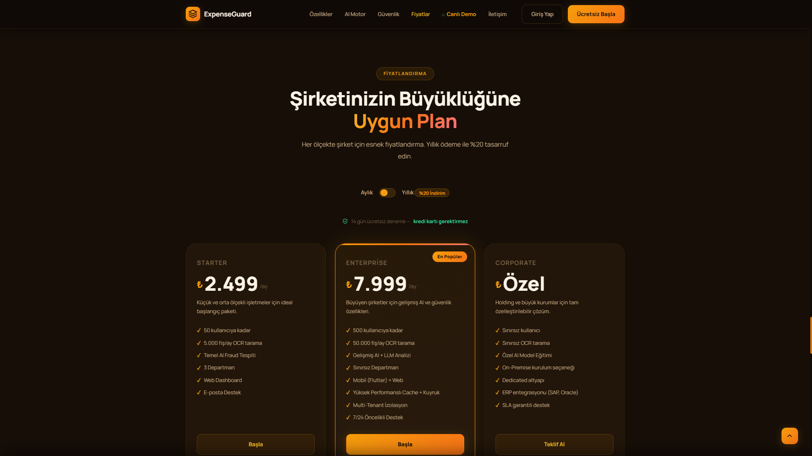 | 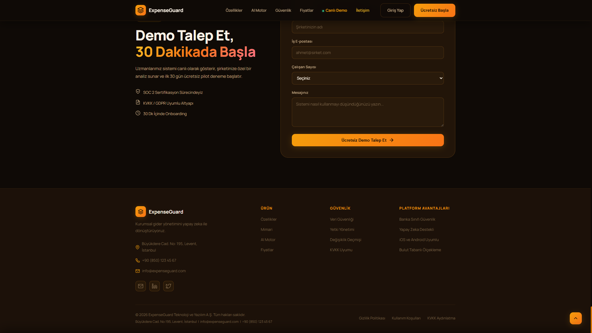 |
| 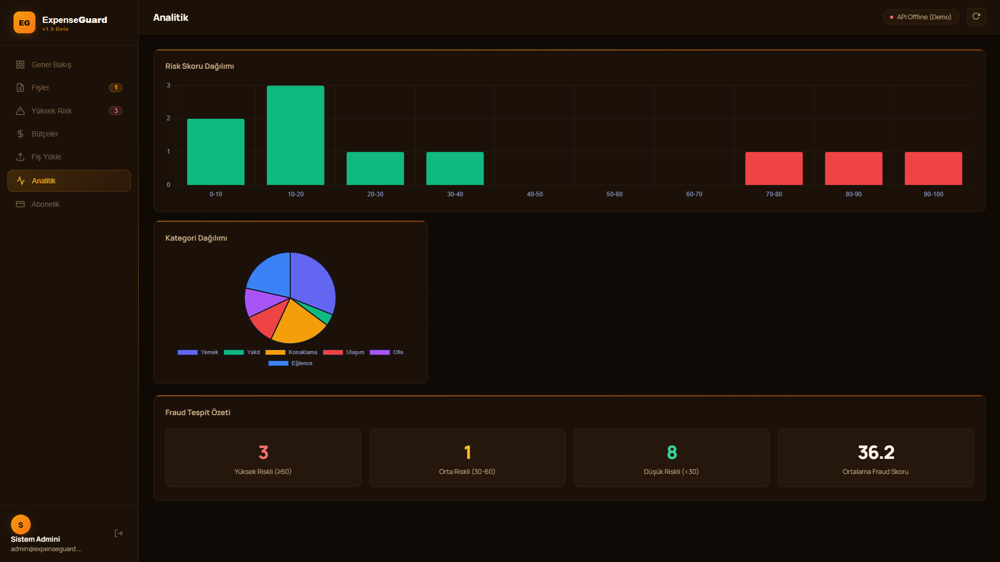 | 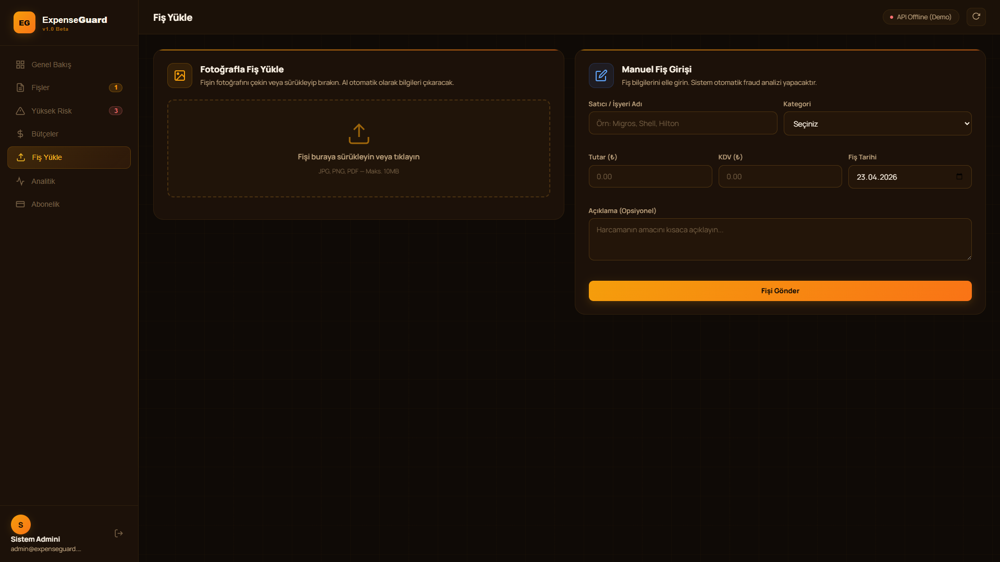 |
| 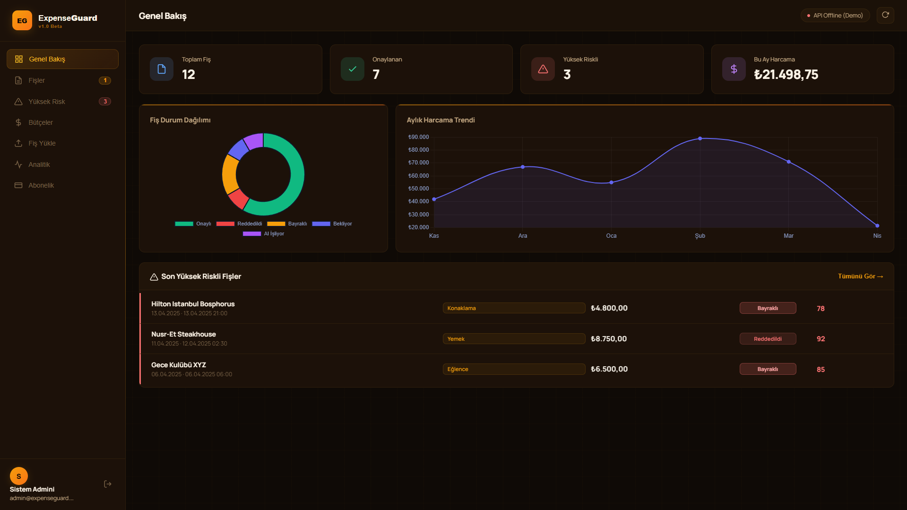 | |

</details>

---

## 📂 Proje Dizin Yapısı

Platform frontend ve backend/mobil bileşenlerini modüler bir düzende tutar:
- `/pages/` - Ana uygulama ekranları (Login, Dashboard, 404 vb.)
- `/legal/` - Kurumsal sözleşme ve aydınlatma metinleri (KVKK, Gizlilik, Şartlar)
- `/css/` & `/js/` - Saf CSS/JS ile yüksek performanslı, Glassmorphism tasarım sistemi
- `/assets/` - Optimizasyonlu (.webp) görseller ve ikon setleri
- `/mobile_app/` - Flutter tabanlı mobil saha uygulaması (Kamera & OCR entegrasyonu)
- `/api/` & `/ai_service/` - .NET 9 Backend ve Python AI servisleri (Docker Compose ile yönetilir)

---

## 🏗️ Mimari ve Teknoloji Yığını

Platform, servis odaklı mimari (SOA) prensipleriyle tasarlanmış olup; Core API, AI işleme motoru ve önbellekleme (caching) katmanları yatayda ölçeklenebilecek şekilde ayrıştırılmıştır.

### ⚙️ Backend (.NET 9)
- **Framework:** ASP.NET Core Web API
- **ORM:** Entity Framework Core (Code-First yaklaşımı)
- **Veritabanı:** PostgreSQL (3NF standardında normalize edilmiş ve hassas veriler için `pgcrypto` şifrelemesi kullanılmıştır)
- **Kimlik Doğrulama:** Refresh Token mimarisine sahip JWT (JSON Web Tokens)
- **Mimari Desen:** Onion Architecture / Clean Architecture (Domain, Application, Infrastructure, API)
- **Dependency Injection:** Dahili `Microsoft.Extensions.DependencyInjection`

### 🧠 Yapay Zeka ve Veri İşleme (Python)
- **Framework:** FastAPI
- **AI Entegrasyonu:** OpenAI GPT-4 Vision API (OCR ve semantik fraud analizi için)
- **Mesaj Kuyruğu (Message Broker):** RabbitMQ (Fişlerin arka planda asenkron olarak işlenmesi için)

### ☁️ Altyapı ve DevOps
- **Konteynerizasyon:** Docker & Docker Compose
- **Önbellekleme:** Redis (Bütçeler ve geçici tokenlar için dağıtık önbellek)
- **Bulut Depolama:** AWS S3 (Fiş görselleri ve dokümanların güvenli depolanması)
- **Ödeme Altyapısı:** Stripe Entegrasyonu (Müşteri ve abonelik yönetimi)
- **Reverse Proxy:** Nginx
- **Gözlem (Observability):** Serilog (Elasticsearch/Kibana uyumlu yapılandırılmış loglama)

### 💻 Frontend
- **Web Paneli:** HTML5, CSS3, Vanilla JavaScript (Özel tasarım sistemi, Modüler Klasör Yapısı, Glassmorphism UI). Framework bağımlılığı olmadan ultra hızlı yükleme.
- **Mobil Uygulama:** Flutter (Saha çalışanlarının fiş fotoğraflarını çekip yükleyebilmesi için cross-platform uygulama)

---

## 🚀 Başlangıç ve Kurulum

Projeyi kendi lokal ortamınızda çalıştırmak için aşağıdaki adımları izleyin.

### Ön Koşullar
- Docker ve Docker Compose
- .NET 9 SDK
- Python 3.10+
- AWS Hesap Kimlik Bilgileri (S3 için)
- Stripe API Anahtarları
- OpenAI API Anahtarı

### 1. Çevre Değişkenleri (Environment Variables)
Proje kök dizininde bir `.env` dosyası oluşturun ve aşağıdaki değişkenleri kendi bilgilerinizle doldurun:

```env
# Veritabanı
POSTGRES_DB=expenseguard
POSTGRES_USER=admin
POSTGRES_PASSWORD=cok_guvenli_sifreniz

# Güvenlik ve Kimlik Doğrulama
Jwt__Secret=MINIMUM_32_KARAKTERLIK_GUVENLI_JWT_ANAHTARINIZ
InternalApiSecret=MIKROSERVISLER_ARASI_ILETISIM_ICIN_GIZLI_ANAHTAR

# AI Servisi
OPENAI_API_KEY=sk-sizin-openai-anahtariniz

# AWS S3 (Bulut Depolama)
AWS_ACCESS_KEY_ID=sizin_aws_keyiniz
AWS_SECRET_ACCESS_KEY=sizin_aws_secretiniz
AWS_REGION=eu-central-1
S3_BUCKET_NAME=expenseguard-receipts

# Stripe (Abonelik)
Stripe__SecretKey=sk_test_sizin_stripe_anahtariniz
```

### 2. Docker Compose ile Başlatma
Tüm altyapıyı tek bir komutla lokalinizde ayağa kaldırmak için:

```bash
docker-compose up -d --build
```
*Not: Bu komut PostgreSQL, Redis, RabbitMQ, .NET Core API ve Python AI servislerini başlatır. Veritabanı şeması `01_schema.sql` dosyası üzerinden otomatik olarak oluşturulacaktır.*

### 3. Servislere Erişim
- **Web Arayüzü:** `http://localhost:3000` (veya doğrudan `index.html` dosyasını açın)
- **.NET API Swagger:** `http://localhost:8080/swagger`
- **RabbitMQ Yönetim Paneli:** `http://localhost:15672` (Kullanıcı: `guest` / Şifre: `guest`)

---

## 🔒 Veritabanı Şeması Güvenliği

PostgreSQL veritabanımız, kurumsal veri güvenliği için gelişmiş özellikler kullanır:
- Veri tabanında atıl durumdaki (at rest) hassas finansal veriler (`amount_encrypted`, `tax_amount_encrypted`), **`pgcrypto`** eklentisi ile simetrik olarak şifrelenir.
- Katı Foreign Key kuralları ve `ON DELETE CASCADE` mekanizması, çok kiracılı hiyerarşide (`Tenants` -> `Departments` -> `Users` -> `Receipts`) veri bütünlüğünü garanti eder.
- Dağıtık sistem uyumluluğu için tüm ID'ler native `gen_random_uuid()` fonksiyonuyla **UUID** formatında üretilir.

---

## 📄 Lisans
Bu proje ticari ve gizlidir. Bu kaynak kodun izinsiz kopyalanması, dağıtılması veya kullanılması kesinlikle yasaktır.
